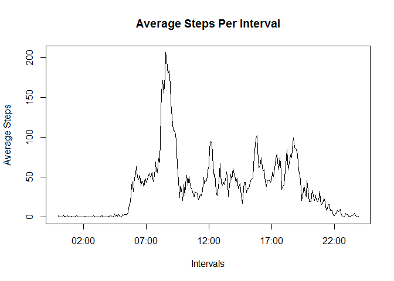
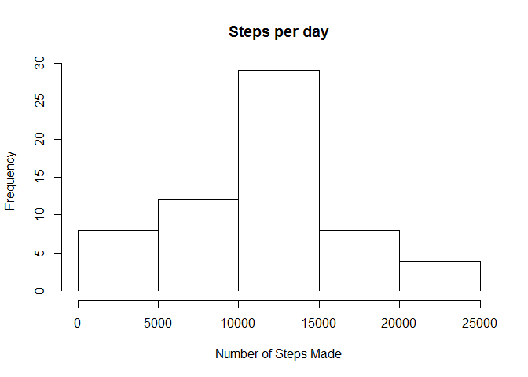
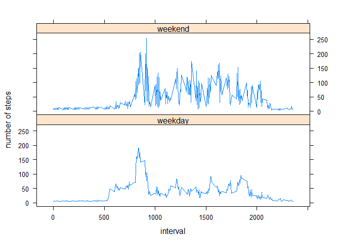

# RR_PeerAssesment
Jose Pereira  


#####First Step: loading and processing the data
So first of all we read the data with the read.csv function, i assigned collumn classes according to the description that was given for the data:

*The variables included in this dataset are:*

-*steps: Number of steps taking in a 5-minute interval (missing values are coded as NA)*

-*date: The date on which the measurement was taken in YYYY-MM-DD format*

-*interval: Identifier for the 5-minute interval in which measurement was taken*


```r
setwd("C:/Users/usuario/Documents/Reproducible Research")
data <- read.csv (unzip("activity.zip"), colClasses = c("numeric","Date","numeric"))
```
#####What is mean total number of steps taken per day?
In order to answer the first question, im going to clean the data and get all the complete cases (i.e: remove Na's), then using the function *aggregate* im going to get the total number of steps per day. Finally in order to graph the steps per day, an histogram will be shown:

```r
data.wna <- data[complete.cases(data),]
data.day <- aggregate (steps ~ date, data = data.wna, FUN = sum)
hist(data.day$steps, breaks = 5, main = "Steps per day", xlab = "Number of Steps Made")
```

 

with this data we can calculate and report the mean and median total number of steps taken per day

```r
media <- mean(data.day$steps)
mediana <- median(data.day$steps)
```
the average steps per day are = `10766.1887` and the median is `10765`

#####What is the average daily activity pattern?
Now im going to calculate the average of steps taken on different intervals of time trough the days. Note that i continue to use the dataset without NA's. Additionally i use the function *strptime* in order to convert the intervals into time values. All this data is graphed on a line plot.

Finally using function *which.max* i get the location for the inverval with the average max. numbser of steps.


```r
data.interval <- aggregate (steps ~ interval , data = data.wna, FUN = mean)
#changing the intervals into time format
data.interval$interval <- strptime(sprintf ("%04d", data.interval$interval ), "%H%M")
plot (data.interval$interval, data.interval$steps,   type = "l", ylab = "Average Steps", xlab = "Intervals", main =  "Average Steps Per Interval")
```

 

```r
#Getting the Average Max for all days
max.steps <- strftime(data.interval[which.max(data.interval$steps),1],format="%H:%M:%S")
```

The 5-minute interval that contains the average maximum number of steps, starts at: `08:35:00`

#####Imputing missing values
Now we calculate the number of missing values in the data, and then we substitute them with the average value for the day. Finally an histogram of the total number of steps taken each day is shown, and we compare the mean and median values of the data with substituted NA's with the one without NA's.


```r
#The number of NA's in the data is#
numberofNA <- sum(is.na(data))
#im gonna get the mean for interval for all the data
data.int <- aggregate (steps ~ interval , data = data, FUN = mean)
#merging the orginal data and the data with averages
test1 <- merge (data.int, data, by = "interval")
#substituting the NA's for the averages on the original data
data$steps[is.na(data$steps)] <- test1$steps.x[is.na(data$steps)]  
# aggegating steps with na= avg for the interval
data.day.avgna <- aggregate (steps ~ date, data = data, FUN = sum)
#Creating the histogram of steps by day without Na's
hist(data.day.avgna$steps, breaks = 5, main = "Steps per day", xlab = "Number of Steps Made")
```

 

```r
#getting the media and median of steps by day
media.avgna <- mean(data.day.avgna$steps)
mediana.avgna <- median(data.day.avgna$steps)
```

The total number of missing values is = `2304`  mean steps per day is: `10889.7993`, and the median steps per day is: `11015`. We can see that when we substitute the NA's with the averages per day, the mean and median are greater that the values obtained when deleting the NA's, ie (`10889.7993` > `10766.1887` and `11015`> `10765` ) so we can say that substituting the NA's with the Averages pushes up the estimate for number of steps per day. 

#####Are there differences in activity patterns between weekdays and weekends?

In this step we are going to look for differences between the activity performed on weekdays and weekends and graph them. In order to do that im going to create a factor variable for weekdays and weekends.  


```r
prueba.fecha <- data
#creates a  new collumn that id's the name with a weekday number
prueba.fecha$datename <- as.POSIXlt(prueba.fecha$date, format='%Y-%m-%d')$wday
#creating a logical factor TRUE for Weekends
prueba.fecha$factor <- prueba.fecha$datename == c(0,6)
#following Robert McAnany advice on the forum, creates a new collumn filled with "weekdays"
prueba.fecha$day <- "weekday"
#look into the factor rows for TRUE's so i can substitute the weekends
prueba.fecha$day[prueba.fecha$factor == TRUE] <- "weekend"
#converting into factors collumn day
prueba.fecha$day <-as.factor(prueba.fecha$day)
#subsetting by weekday and creating a new dataset with only weekday data
weekdaydata <- prueba.fecha[prueba.fecha$day == "weekday",] 
#doing the same for weekends
weekendata <- prueba.fecha[prueba.fecha$day == "weekend",]
#now i use aggregate in order to get the mean steps per day. i do this for weekdays and weekends
weekday.lattice <- aggregate (steps ~ interval+day, data = weekdaydata, FUN = mean)
weekendata.lattice <- aggregate (steps ~ interval+day, data = weekendata, FUN = mean)
# use rbind to get a single dataset (data.lattice) with the aggregated data and order the new dataset
data.lattice <- rbind (weekday.lattice, weekendata.lattice)
data.lattice <- data.lattice[order(data.lattice$interval),]
#and graphing
library (lattice)
xyplot(steps~interval| day, data = data.lattice, layout= c(1,2), type = "l", ylab = "number of steps")
```

 

We can see that there is more activity performed on weekends than on weekdays.
